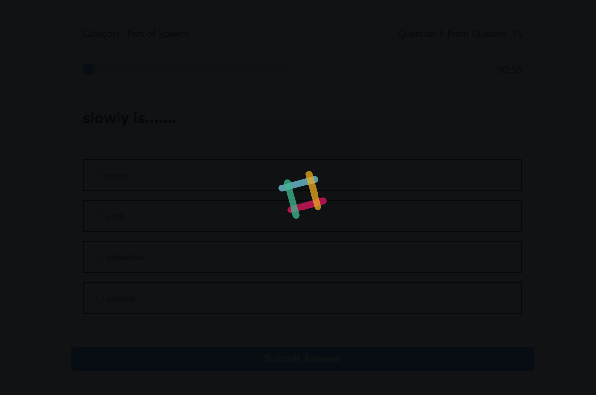
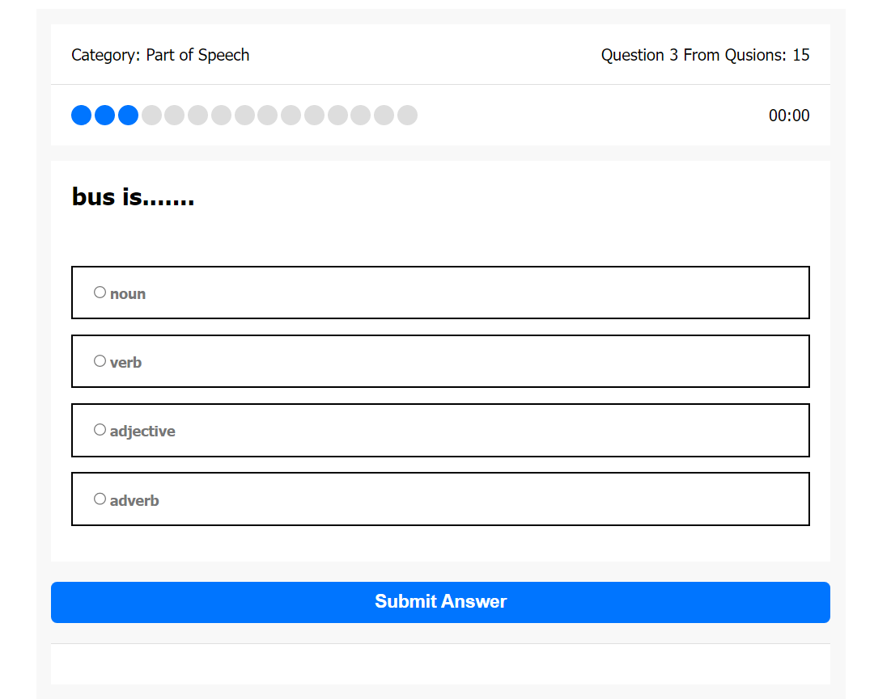
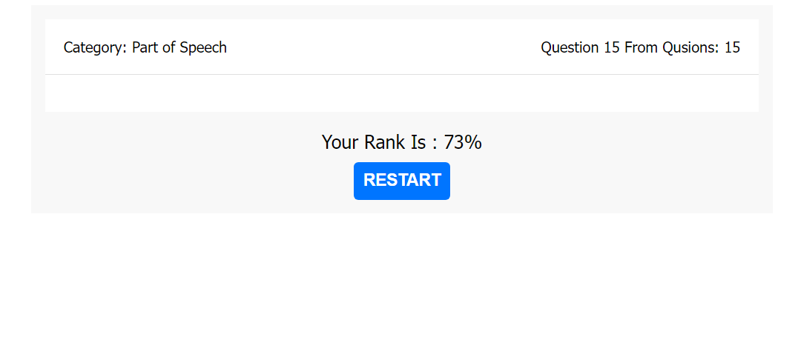

# Quiz_App
It is a Quiz App about "Part of Speech" to show you the word and choose this worde is (noun, verb, adjective,....) and use countdown for each qustion if it finished, will go to another qustion and after finished test you will give you the rank and restart button to restart the Quiz.

## Live Demo:  
   - Link: https://ahmed-abo-rafat.github.io/NewsFlash/

## Setup
To run this project: 

```
$ dowload project
$ open with live server
```

## Technologies
Project is created with:
   - html
   - css
   - js
   - json
   - nice Loader with animation.
   
### Result


<br>


<br>



